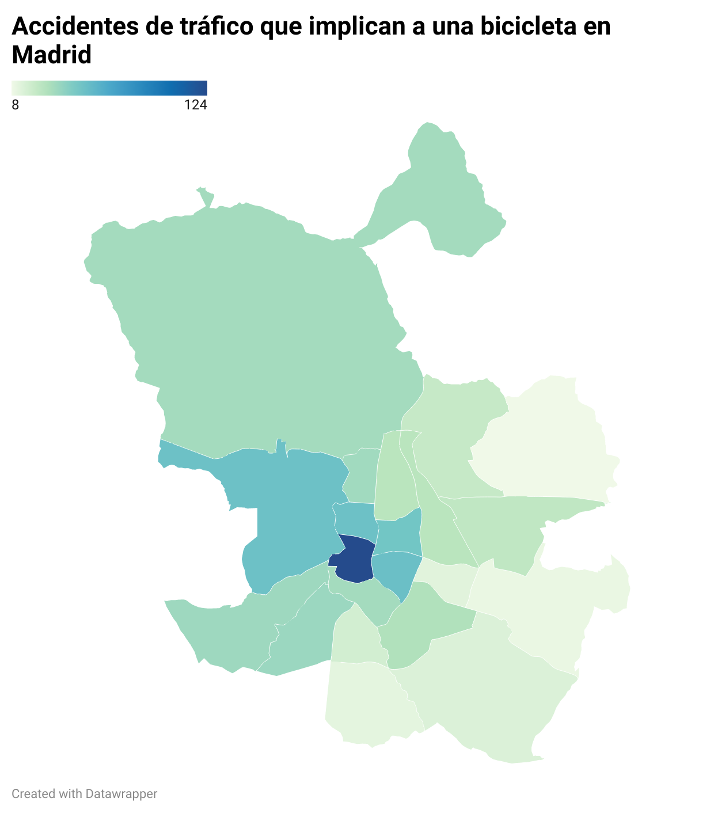

# Realización de una visualización en *Datawrapper*
Esta visualización se ha realizado con una base de datos diferente a la propuesta por el profesor. Se puede consultar dicha dataset en este [enlace](https://datos.gob.es/es/catalogo/l01280796-accidentes-de-trafico-con-implicacion-de-bicicletas). El objetivo de la visualización que he elaborado es localizar geográficamente dónde se producen más accidentes con bicicletas.

Para consultar la visualización interactiva, haga clic en este [enlace](https://datawrapper.dwcdn.net/8z5IG/2/).

## Proceso de limpieza de datos en *OpenRefine*

Esta base de datos muestra cada uno de los accidentes de tráfico con implicación de bicicletas en 2018. Cada incidente está detallado con datos de las circunstancias en las que se produjo el accidente, como en qué calle se produjo, la hora, si había granizo en la carretera… 

Como solo nos interesa el distrito, elimino todas las columnas y me quedo únicamente con la columna de los distritos. Ahora, para saber el número exacto de accidentes que ha habido en cada distrito, selecciono la opción **Edit Column** y después **Add column based on this column**. Una vez realizado esto, introduzco **value.facetCount(‘value’,’Distrito’)**. El nombre de la nueva columna es Nº accidentes. 

De esta manera, obtengo el número de veces que se repite cada distrito en la base de datos que es el equivalente al número de accidentes que se produjeron en el año 2018 en dicho distrito.

Ahora solo me enfrento a dos columnas y pero todavía tengo 700 filas. Observo que la gran mayoría de filas muestran los mismos datos. Por ejemplo, Centro, 124. Este dato aparece repetido 124 veces y solo me interesa una fila. Por ello, elimino todas las filas que muestran los mismos datos. Mi objetivo es quedarme con 21 filas, una por distrito.  Para ello, selecciono **Edit rows** y **Star Row** para marcar todas las filas. Manualmente, desmarco una fila por distrito y luego selecciono **Remove matching rows**

## Procesar los datos en *Datawrapper*

Ya tengo los datos limpiados. Ahora toca procesarlos en *Datawrapper*. Para realizar esto, selecciono la opción para diseñar un mapa y después elijo la zona geográfica que quiero, en este caso, la ciudad de Madrid dividida en distritos. 

El programa no entiende algunos términos por lo que toca modificarlos manualmente desde *Datawrapper*. En el dataset, Chamberí carecía de tilde, así que la añado. Realizo lo mismo con el resto de palabras a las que les faltaba la vírgula. También cambio el término Moncloa-Aravaca, por simplemente Moncloa ya que el mapa reconoce esta ubicación de esta manera y desconoce el otro término.

Tras terminar estos cambios, el mapa ya muestra los datos correctamente. Con esto, ya esta concluida la visualización.

## Comentario de la visualización obtenida

Gracias a este mapa se puede visualizar el número de accidentes de tráfico con implicación de una bicicleta en las diferentes zonas de Madrid con tan solo un golpe de vista. 

La elección del azul es acertada ya que, según la teoría del color, el azul evoca seriedad y confianza, que es lo que un medio quiere transmitir a sus lectores. 

Según la tonalidad de azul más oscuro o más clara podemos deducir si el número de accidentes es elevado o alto, respectivamente. El mapa muesta el distrito centro muy oscuro y los distritos del sur más claros. Esto probablemente se deba a que la circulación de bicicletas por el centro de la ciudad es más elevada que en la periferia, lo que produce más accidentes con este medio de transporte. 

El mayor problema de visualización que presenta este mapa es la extrema claridad de las zonas con poco accidentes. Estas zonas corresponden con los distritos Usera, Villaverde, Vallecas, Vicálvaro y Moratalaz. El color aquí es tan blanco que da la sensación de que en estas zonas no hay accidentes cuando realmente no es así.

